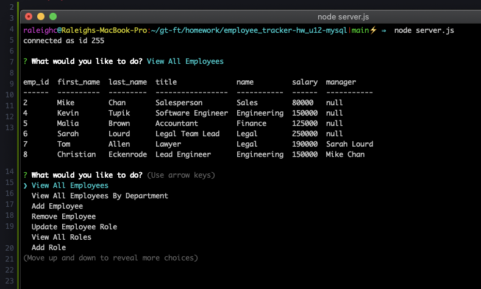

# Employee Tracker

## Description

This application allows the user to build a database of employees and their relevant information.

## Usage

To begin, the user must first run "npm install inquirer", "npm install mysql", and "npm install console.table". Then enter "node server.js" in the command line to begin the application.
The user will want building their team by first creating a department then creating roles assigned to that department, then finally employees assigned to those roles. After populating their table, the user can then manager their table with add and remove functions for each category. As they make changes they can view all departments, all roles, employees by department, or all employees which contains all associated information connected to each employee. Upon completion the user will select "Exit" to terminate their connection to the database and close the application.

[Video Demo](https://drive.google.com/file/d/1WUAeYLCsiBOYl5KiLCVpmlxNrS4B2RGD/view?usp=sharing)

## Creating This Page

For this project, I built a database using MySql and then built an Inquirer driven Command Line Application which pulls from and stores information in my database. This project was a challenge at every step. The snowball effect never really kicked in as new problems popped up on every new function that was created.

## Contributions

When contributing to this repository, please contact the owner of the repository before pushing any updates.
When contributions are accepted, please update the readme.md noting any changes that have been made.

## Authors and Acknowledgment

All files for this project were created and written by Raleigh Chesney.

NPMs:
* [Inquirer](https://www.npmjs.com/package/inquirer)
* [MySql](https://www.npmjs.com/package/mysql)
* [Console.Table](https://www.npmjs.com/package/console.table)

Web Dev Tools:
* [Mozille Developer Network](https://developer.mozilla.org/en-US/)
* [Stack Overflow](https://stackoverflow.com/)
* [w3schools!](https://www.w3schools.com/bootstrap4/default.asp)

Thank you to all of my GT Bootcamp classmates who have offered advice and helped fix bugs alone the way.

Special thanks to Peter Colella for instruction and help with my code.
## License

MIT License

Copyright (c) 2020 Raleigh Chesney

Permission is hereby granted, free of charge, to any person obtaining a copy
of this software and associated documentation files (the "Software"), to deal
in the Software without restriction, including without limitation the rights
to use, copy, modify, merge, publish, distribute, sublicense, and/or sell
copies of the Software, and to permit persons to whom the Software is
furnished to do so, subject to the following conditions:

The above copyright notice and this permission notice shall be included in all
copies or substantial portions of the Software.

THE SOFTWARE IS PROVIDED "AS IS", WITHOUT WARRANTY OF ANY KIND, EXPRESS OR
IMPLIED, INCLUDING BUT NOT LIMITED TO THE WARRANTIES OF MERCHANTABILITY,
FITNESS FOR A PARTICULAR PURPOSE AND NONINFRINGEMENT. IN NO EVENT SHALL THE
AUTHORS OR COPYRIGHT HOLDERS BE LIABLE FOR ANY CLAIM, DAMAGES OR OTHER
LIABILITY, WHETHER IN AN ACTION OF CONTRACT, TORT OR OTHERWISE, ARISING FROM,
OUT OF OR IN CONNECTION WITH THE SOFTWARE OR THE USE OR OTHER DEALINGS IN THE
SOFTWARE.

